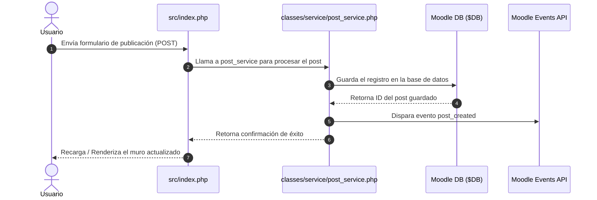

# Arquitectura del Sistema

## Visión general
El plugin `local_chuspasocial` para Moodle 4.5 adopta una arquitectura por capas modular y orientada a servicios, diseñada para extender las capacidades sociales de Moodle manteniendo compatibilidad nativa con sus APIs core (`$DB`, Events API, Renderers y Forms API).

## Componentes principales
- **Controladores / Vistas (`src/`)**: Puntos de entrada HTTP que procesan las peticiones del usuario y renderizan las vistas principales (ej. `src/index.php`).
- **Capa de Servicios (`classes/service/`)**: Encapsula las reglas de negocio y validaciones del plugin (ej. `post_service.php`).
- **Capa de Persistencia y Eventos**: Almacenamiento en base de datos mediante la API `$DB` de Moodle y emisión de eventos del sistema.

## Diagrama de arquitectura
```text
+-------------------------------------------------------+
|                 Capa de Presentación                  |
|                 (src/index.php, UI)                   |
+-------------------------------------------------------+
                           |
                           v
+-------------------------------------------------------+
|                   Capa de Servicio                    |
|           (classes/service/post_service.php)          |
+-------------------------------------------------------+
              /                         \
             v                           v
+------------------------+   +--------------------------+
|  Persistencia Moodle   |   |   API de Eventos Moodle  |
|         ($DB)          |   |  (\local_chuspasocial\..) |
+------------------------+   +--------------------------+
```

## Tecnologías utilizadas

| Componente | Tecnología | Versión | Justificación |
|---|---|---|---|
| **LMS Base** | Moodle | 4.5+ | Plataforma educativa principal sobre la cual se despliega el plugin local. |
| **Backend** | PHP | 8.1+ | Lenguaje nativo de desarrollo para la API y controladores de Moodle. |
| **Base de Datos** | MariaDB / PostgreSQL | 10.6+ / 13+ | Motores relacionales compatibles con la capa de abstracción `$DB` de Moodle. |
| **Frontend** | Mustache / JS (AMD/ES6) | Native | Motor de plantillas y clientes de script nativos de Moodle para UI dinámica. |

## Decisiones de diseño

### Decisión 1
**Contexto:** Necesidad de desacoplar la lógica de procesamiento de publicaciones de los controladores de entrada HTTP directos (`src/*.php`).  
**Decisión:** Implementar una capa de servicio dedicada en `classes/service/post_service.php`.  
**Consecuencias:** Facilita la reutilización de código, simplifica las pruebas unitarias y mantiene los controladores de la carpeta `src/` livianos.

## Flujo de datos

El siguiente diagrama de secuencia detalla el flujo de datos cuando un usuario crea una nueva publicación en el muro:



1. El usuario envía los datos del formulario al controlador `src/index.php`.
2. `src/index.php` delega la validación y lógica a `post_service.php`.
3. `post_service.php` guarda el registro en la base de datos mediante la API `$DB`.
4. Tras confirmarse el guardado, se notifica al sistema emitiendo el evento `post_created`.
5. El controlador recibe la confirmación y vuelve a renderizar el muro actualizado.
