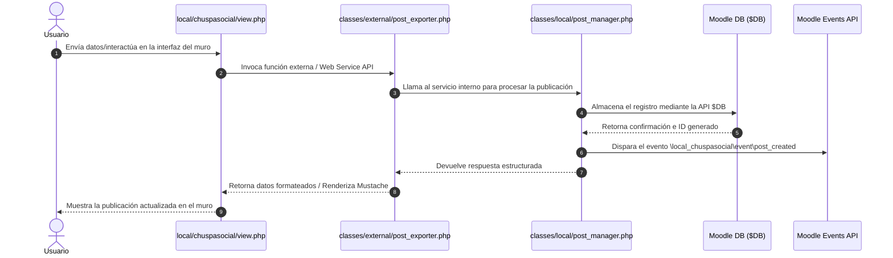

# Arquitectura del Sistema

## Visión general
El plugin `local_chuspasocial` para Moodle 4.5 adopta una arquitectura por capas modular y orientada a servicios, diseñada para extender las capacidades sociales de Moodle manteniendo compatibilidad nativa con sus APIs core (`$DB`, Events API, Renderers y Forms API).

## Componentes principales
- **Vistas / Controladores de Página**: Puntos de entrada HTTP que procesan las peticiones del usuario (ej. `view.php`).
- **Funciones Externas (`classes/external/`)**: APIs para solicitudes AJAX y servicios web.
- **Servicios Internos (`classes/local/`)**: Encapsulan la lógica de negocio y validaciones del plugin (ej. `post_manager.php`).
- **Capa de Persistencia y Eventos**: Almacenamiento en base de datos mediante la API `$DB` de Moodle y emisión de eventos del sistema.

## Diagrama de arquitectura
```text
+-------------------------------------------------------+
|                   Capa de Presentación                |
|                   (view.php, UI)                      |
+-------------------------------------------------------+
                            |
                            v
+-------------------------------------------------------+
|             Capa de Servicios & APIs                  |
|     (classes/external/  |  classes/local/)            |
+-------------------------------------------------------+
              /                           \
             v                             v
+------------------------+   +--------------------------+
|  Persistencia Moodle   |   |   API de Eventos Moodle  |
|        ($DB)           |   |  (\local_chuspasocial\..) |
+------------------------+   +--------------------------+
```

## Tecnologías utilizadas

| Componente | Tecnología | Versión | Justificación |
|---|---|---|---|
| **LMS Base** | Moodle | 4.5+ | Plataforma educativa principal sobre la cual se despliega el plugin local. |
| **Backend** | PHP | 8.1+ | Lenguaje nativo de desarrollo para la API y controladores de Moodle. |
| **Base de Datos** | MariaDB / PostgreSQL | 10.6+ / 13+ | Motores relacionales compatibles con la capa de abstracción `$DB` de Moodle. |
| **Frontend** | Mustache / JS (AMD/ES6) | Native | Motor de plantillas y clientes de script nativos de Moodle para UI dinámica. |

## Decisiones de diseño

### Decisión 1
**Contexto:** Necesidad de desacoplar la lógica de procesamiento de publicaciones de los controladores HTTP directos.  
**Decisión:** Implementar servicios locales en `classes/local/` (ej. `post_manager.php`) y funciones en `classes/external/` para peticiones AJAX.  
**Consecuencias:** Facilita la reutilización de código, simplifica las pruebas unitarias y mantiene la interfaz modular.

## Flujo de datos

El siguiente diagrama de secuencia detalta el flujo de datos cuando un usuario crea una nueva publicación en el muro:



1. El usuario interactúa con la vista principal (`view.php`).
2. Se procesa la solicitud invocando la API de función externa (`classes/external/`).
3. El manejador local (`classes/local/post_manager.php`) ejecuta la validación y lógica de negocio.
4. Se guarda el registro en la base de datos mediante la API `$DB`.
5. Se emite el evento `post_created` a través de la Events API de Moodle.
6. La respuesta se envía formateada a la vista y se renderiza el muro actualizado para el usuario.
